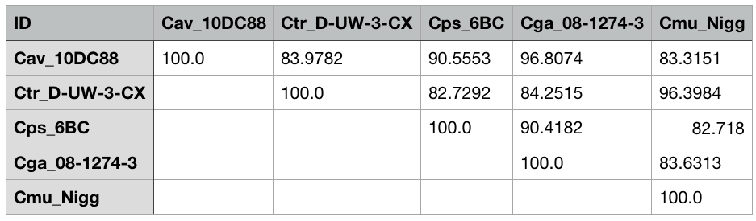

# Calculation of the Percentage Of Conserved Proteins


[](https://twitter.com/martinhoelzer) 

1. [ Objective ](#objective)
2. [ How? ](#how)
3. [ Requirements ](#need)
4. [ Execution examples ](#run)
5. [ Example output ](#example)
6. [ Extend a calculation with more genomes ](#extend)
7. [ A note on alignment calculation (DIAMOND vs. BLASTP) and benchmarking ](#diamond)
8. [ Parameter adjustments (danger zone) ](#parameter)
9. [ All-vs-All and One-vs-All ](#allvsall)
10. [ Cite ](#cite)
11. [ Update backlog ](#backlog)

<a name="objective"></a>

## Objective

Sequence technology advancements have led to an exponential increase in bacterial genomes, necessitating robust taxonomic classification methods. The **P**ercentage **O**f **C**onserved **P**roteins (POCP), proposed initially by [Qin, Xie _et al_. 2014](https://www.ncbi.nlm.nih.gov/pubmed/24706738), is a valuable metric for assessing prokaryote genus boundaries. A prokaryotic genus can be defined as a group of species with all pairwise POCP values higher than 50%. Here, I introduce a computational pipeline for automated POCP calculation, aiming to enhance reproducibility and ease of use in taxonomic studies ([see publication in OUP Bioinformatics]((https://academic.oup.com/bioinformatics/article/40/4/btae175/7638801))).

<a name="how"></a>

## How?

As input use one amino acid sequence FASTA file per genome such as provided by
[Prokka](https://github.com/tseemann/prokka) or [Bakta](https://github.com/oschwengers/bakta) or genome FASTA files which will be then annotated via [Prokka](https://github.com/tseemann/prokka) automatically. The pipeline will then calculate all-vs-all pairwise alignments between all protein sequences using the blastp mode of [DIAMOND](https://www.nature.com/articles/nmeth.3176) and use this information for POCP calculation following the original formula of [Qin, Xie _et al_. 2014](https://www.ncbi.nlm.nih.gov/pubmed/24706738). One-vs-all comparisons are also possible, see below.

<a name="need"></a>

## Requirements

You only need `nextflow` to install and run the pipeline. `nextflow` will take care of all dependencies and install them if necessary. For installing the dependencies (such as Prokka and DIAMOND), you can choose between `conda`, `mamba`, `docker` or `singularity`. I recommend using `docker`. Then install and run the pipeline:

### Workflow management

- [Nextflow](https://www.nextflow.io/docs/latest/getstarted.html#installation)

### Dependencies management

- [Conda/Mamba](https://docs.conda.io/en/latest/miniconda.html)
- [Docker](https://docs.docker.com/get-docker/)
- [Singularity](https://apptainer.org/docs/)

Use the `-profile` parameter to switch between different dependency managers, e.g. `-profile conda`.

<a name="run"></a>

## Execution examples

```bash
# get the pipeline code
nextflow pull hoelzer/pocp 

# check availble release versions and development branches, recommend to use latest release
nextflow info hoelzer/pocp 

# get the help page and define a release version. ATTENTION: use latest version. 
nextflow run hoelzer/pocp -r 2.3.0 --help

# example with genome files as input, all-vs-all comparison, performing a local execution and using Docker
nextflow run hoelzer/pocp -r 2.3.0 --genomes $HOME'/.nextflow/assets/hoelzer/pocp/example/*.fasta' -profile local,docker

# example with protein FASTA files as input (e.g. from Prokka pre-calculated), all-vs-all comparison, performing a SLURM execution and using conda
nextflow run hoelzer/pocp -r 2.3.0 --proteins $HOME'/.nextflow/assets/hoelzer/pocp/example/*.faa' -profile slurm,conda

# example with genome files as input, additional genome file to activate one-vs-all comparison, performing a local execution and using Docker
nextflow run hoelzer/pocp -r 2.3.0 --genomes $HOME'/.nextflow/assets/hoelzer/pocp/example/*.fasta' --genome $HOME/.nextflow/assets/hoelzer/pocp/example/Cav_10DC88.fasta -profile local,docker
```

<a name="example"></a>

## Example output

The final output (`pocp-matrix.tsv`) should look like this (here, the resulting TSV was imported into Numbers on MacOS):



<a name="extend"></a>

## Extend a calculation with more genomes

`nextflow` allows you to resume a calculation without recalculating previous steps. This is possible, because `nextflow` stores intermediate and results files in a `work` directory. If you want to resume a calculation later, dont delete the `work` directory and use the same `nextflow run` command. For example:

```bash
# first iteration
nextflow run hoelzer/pocp -r 2.3.0 --genomes 'input/*.fasta' -profile local,docker

# add more genomes to the input folder:
cp /some/other/genomes/*.fasta input/

# resume the calculation via adding "-resume".
nextflow run hoelzer/pocp -r 2.3.0 --genomes 'input/*.fasta' -profile local,docker -resume
```

<a name="diamond"></a>

## A note on alignment calculation (DIAMOND vs. BLASTP) and benchmarking

The pipeline identifies orthologous proteins between species using DIAMOND in blastp mode. Please note that the original POCP publication used BLASTP for calculating the alignments. However, DIAMOND is not only faster, which is an advantage when calculating POCP values for larger input data sets, but also achieves the sensitivity of BLASTP ([Buchfink (2021)](https://www.nature.com/articles/s41592-021-01101-x)), especially when using the `--ultra-sensitive` mode, which is activated by default in the pipeline. Another study comparing different alignment programs found that DIAMOND offered the best compromise between speed, sensitivity and quality when a sensitivity option other than the default setting was selected ([Hernández-Salmerón and Moreno-Hagelsieb (2020)](https://bmcgenomics.biomedcentral.com/articles/10.1186/s12864-020-07132-6)). Therefore I decided to use DIAMOND as a more modern solution for the alignment calculation in POCP-nf. Thx [@michoug](https://github.com/michoug) for the idea and the Pull Request.

Using five bacteria data sets spanning 15 to 167 input genomes, I calculated that the **average difference in percentage of POCP scores is ~0.16 %** between using BLASTP or DIAMOND in `--ultra-sensitive` mode. The runtime (without Prokka annotation, `--proteins` input) for 44 _Enterococcus_ genomes (comprising 1,892 pairwise comparisons) is halved from 10h 12m (BLASTP) to 5h 30m (DIAMOND) on a laptop with 8 cores.

**If you are interested in more details, [check out this little benchmark](blastp-vs-diamond-benchmark/README.md).**

<a name="parameter"></a>

## Parameter adjustments (danger zone)

**Attention**: Although you can customize core parameters in the `nextflow` pipeline, I recommend sticking to the original parameters defined by [Qin, Xie _et al_. 2014](https://www.ncbi.nlm.nih.gov/pubmed/24706738) and otherwise clearly indicating any changed parameter options along with the version of POCP-nf used when sharing POCP results! The default parameters defined in the configuration of the pipeline are:

```bash
--evalue 1e-5
--seqidentity 0.4
--alnlength 0.5
```

**A warning will be shown by the pipeline if you change these parameters.**

<a name="allvsall"></a>

## All-vs-All and One-vs-All

Please also note that per default an "all-vs-all" comparison is performed based on the provided FASTA files. However, you can also switch to an "one-vs-all" comparison by additionally providing a single genome FASTA via `--genome` next to the `--genomes` input **or** a single protein multi-FASTA via `--protein` next to the `--proteins` input. In both cases, only "one-vs-all" comparisons will be performed. It is also possible to combine `--genomes` with a target `--protein` FASTA for "one-vs-all" and vice versa. 

<a name="cite"></a>

## Cite

If you use the POCP Nextflow pipeline, please cite the original POCP study that introduced the metric, the publications of the great tools used in the pipeline, and the POCP-nf pipeline:

[Qin, Qi-Long, _et al_. "A proposed genus boundary for the prokaryotes based on genomic insights." Journal of bacteriology 196.12 (2014): 2210-2215.](https://pubmed.ncbi.nlm.nih.gov/24706738/)

[Martin Hölzer. "POCP-nf: an automatic Nextflow pipeline for calculating the percentage of conserved proteins in bacterial taxonomy". Bioinformatics. 2024.](https://academic.oup.com/bioinformatics/article/40/4/btae175/7638801)

[Buchfink, Benjamin, Chao Xie, and Daniel H. Huson. "Fast and sensitive protein alignment using DIAMOND." Nature methods 12.1 (2015): 59-60.](https://www.nature.com/articles/nmeth.3176)

[Seemann, Torsten. "Prokka: rapid prokaryotic genome annotation." Bioinformatics 30.14 (2014): 2068-2069.](https://doi.org/10.1093/bioinformatics/btu153)

<a name="backlog"></a>

## Updates backlog

__Update 2023/12: One-vs-All comparisons are now possible in genome and protein input mode. Check `--help` message.__

__Update 2023/10: Now using [Diamond](https://www.nature.com/articles/s41592-021-01101-x) instead of Blastp for protein alignments. Thx [@michoug](https://github.com/michoug) for the Pull Request.__

__Update 2023/05: Re-implementation as a [Nextflow pipeline](nextflow.io). Please feel free to report any [issues](https://github.com/hoelzer/pocp/issues)!__
