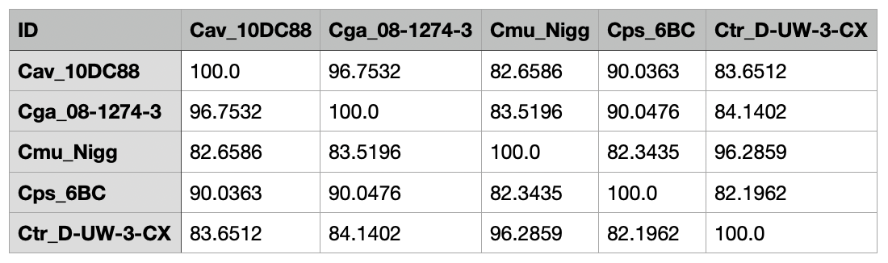

# Calculation of the Percentage Of Conserved Proteins


[](https://twitter.com/martinhoelzer) 

__Update 2023/05: Re-implementation as a [Nextflow pipeline](nextflow.io). Please feel free to report any [issues](https://github.com/hoelzer/pocp/issues)!__

__Update 2023/10: Now using [Diamond](https://www.nature.com/articles/s41592-021-01101-x) instead of Blast for protein alignments. Thx [@michoug](https://github.com/michoug) for the Pull Request.__

As input use one amino acid sequence FASTA file per genome such as provided by
[Prokka](https://github.com/tseemann/prokka) or genome FASTA files which will be then annotated via [Prokka](https://github.com/tseemann/prokka). 
The pipeline will then calculate all pairwise alignments between all protein sequences and use this
information for POCP calculation following [Qin, Xie _et al_.
2014](https://www.ncbi.nlm.nih.gov/pubmed/24706738). 

You only need `nextflow` and `conda` or `mamba` or `docker` or `singularity` to run the pipeline. I recommend using `docker`. Then install and run the pipeline:

```bash
# get the pipeline code
nextflow pull hoelzer/pocp 

# check availble release versions and development branches
nextflow info hoelzer/pocp 

# get the help page and define a release version. ATTENTION: use latest version. 
nextflow run hoelzer/pocp -r 2.1.0 --help

# example with genome files as input, performing a local execution and using Docker
nextflow run hoelzer/pocp -r 2.1.0 --genomes 'example/*.fasta' -profile local,docker

# example with protein FASTA files as input (e.g. from Prokka pre-calculated), performing a SLURM execution and using conda
nextflow run hoelzer/pocp -r 2.1.0 --proteins 'example/*.faa' -profile slurm,conda
```

The final output (`pocp-matrix.tsv`) should look like this (here, the resulting TSV was imported into Numbers on MacOS):



If needed, the following parameters used for filtering the `diamond` results (blastp mode) can be
adjusted:

```bash
--evalue 1e-5
--seqidentity 0.4
--alnlength 0.5
```
