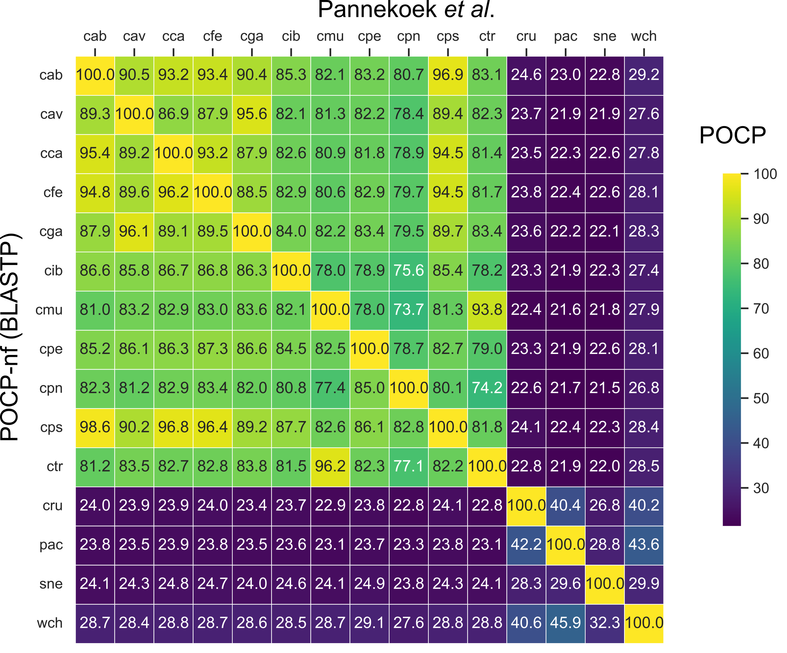
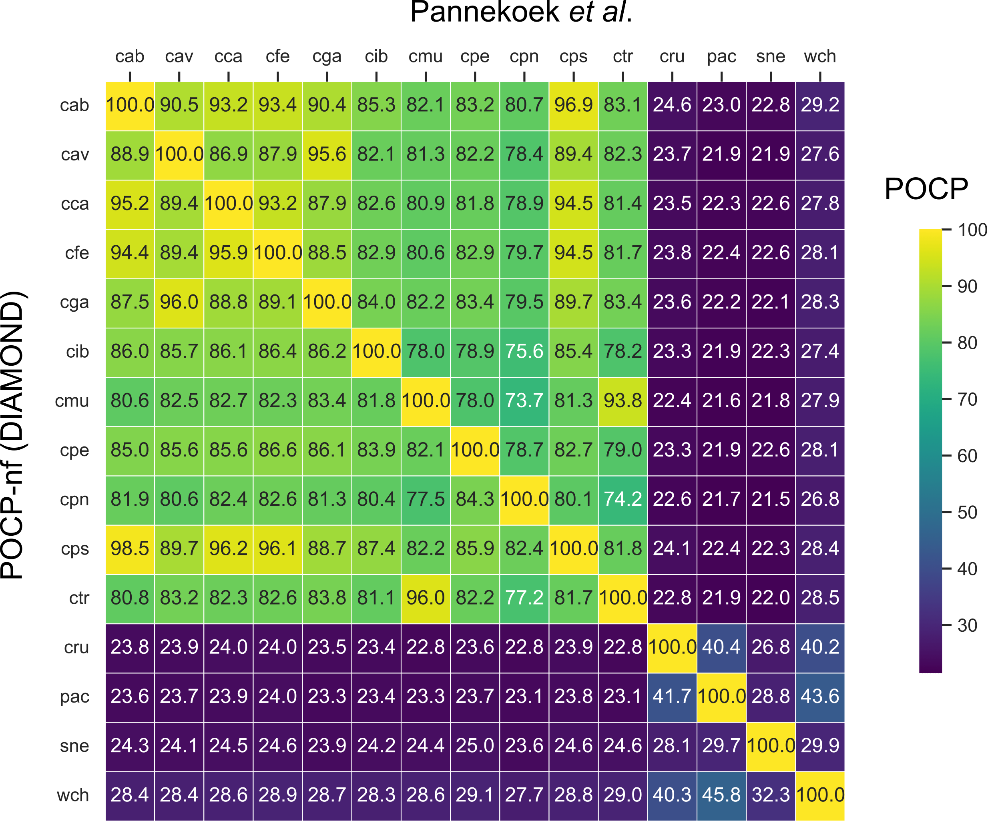

# Calculation of the Percentage of Conserved Proteins

## Previous benchmarks: BLASTP vs. DIAMOND

Different independent benchmarks have already compared DIAMOND and BLAST(X,P). For example, some resources showed that DIAMOND is not only faster than BLASTP but can be even more sensitive:

* https://bioinfoperl.blogspot.com/2016/12/diamond-as-alternative-to-blastp.html
* https://www.biostars.org/p/9475302/

Of course, the original authors of DIAMOND also had to benchmark against BLAST. [Their study](https://www.nature.com/articles/nmeth.3176), published in the same year as the POCP definition, showed that DIAMOND is much faster and has a similar degree of sensitivity compared to BLASTX (translated protein search). As for BLASTP, a relatively [recent article from 2021](https://www.nature.com/articles/s41592-021-01101-x), comparing DIAMOND and BLASTP, showed that DIAMOND 

> greatly exceeds previous search performances and harnesses supercomputing to perform tree-of-life scale protein alignments in hours while matching the sensitivity of the gold standard BLASTP.

Especially, when using the "ultra-sensitive" mode of DIAMOND, which is also activated by [default in POCP-nf](https://github.com/hoelzer/pocp/blob/main/modules/diamond.nf#L19). This was also shown by another recent and independent study ([Hernández-Salmerón (2020)](https://link.springer.com/article/10.1186/s12864-020-07132-6)). Hernández-Salmerón _et al_. conclude, in comparison to BLASTP, that the 

> best compromise for obtaining reciprocal best hits was diamond with the very-sensitive option 

and suggest 

> that diamond with the sensitive mode would already be a good substitute for blastp

evaluated on various species and proteomes.

## Benchmarking BLASTP vs. DIAMOND with POCP-nf

These benchmarks were performed using release version 2.3.1 of POCP-nf. 

### Data set, Pannekoek _et al._

To illustrate the difference in POCP values, I executed POCP-nf in the default mode (DIAMOND) and with BLASTP (`--blastp` parameter). BLASTP was used in v2.15.0 and DIAMOND in v2.1.9 First, I used the _Chlamydia_ data set from [Pannekoek _et al_.](https://academic.oup.com/femspd/article/74/6/ftw071/2198082?login=false) for benchmarking, like in the heat map in the manuscript. I executed POCP-nf one time with BLASTP (Fig. 1) and one time with DIAMOND (Fig. 2) on this data set. 

**Fig. 1** POCP-nf (BLASTP), lower triangle vs. Pannekoek _et al_., upper triangle. 

**Fig. 2** POCP-nf (DIAMOND), lower triangle vs. Pannekoek _et al_., upper triangle. This is the same heatmap as in the manuscript.

Then, I calculated the percentage of the difference between running POCP-nf with BLASTP and DIAMOND (Fig. 3). The maximum pairwise difference, for this example, is ~0.7 %. The average percentage of difference in POCP scores between BLASTP and DIAMOND is 0.289 % for this data set. 

**Fig. 3** Percentage of difference of POCP values calculated with POCP-nf using BLASTP or DIAMOND on the _Chlamydia_ Pannekoek _et al_. example data.

Motivated by this comparison, I also calculated the percentage of the difference between the original published POCP values from [Pannekoek _et al_.](https://academic.oup.com/femspd/article/74/6/ftw071/2198082?login=false) and POCP-nf in BLASTP mode (Fig. 4). The average difference in POCP is 1.88 %. Please note that a comparison with POCP-nf in DIAMOND mode would yield similar results (as shown in Fig. 3).

**Fig. 4** Differences of POCP values between POCP-nf(BLASTP) and Pannekoek _et al._.

As you can see from Figs. 3 and 4, also via using BLASTP, I can’t exactly reproduce the results from the original study, although I am using the same core parameters from the POCP definition. The percentage difference is even greater between the earlier and less reproducible study and BLASTP in POCP-nf (Fig. 4) compared to using BLASTP or DIAMOND in POCP-nf (Fig. 3). 
Reasons could be other differences or, for example, different protein inputs used back then and what I'm calculating now with Prokka in POCP-nf. With POCP-nf, everything is always reproducible using the same pipeline version and input files.  

### Additional data sets 

In addition, I also compared BLASTP and DIAMOND within POCP-nf on four other data sets, we recently prepared for a [pangenome study](https://www.biorxiv.org/content/10.1101/2023.05.05.539552v1). The input genome FASTA files are available [at OSF](https://osf.io/g52rb) and comprise _Enterococcus_ (44 genomes), _Brucella_ (71), _Chlamydia_ (102), and _Klebsiella_ (167) species. I ran POCP-nf in version 2.3.1 one time with BLASTP and one time with DIAMOND, as explained above. Then, I calculated the difference in POCP similar to Fig. 3. The average differences in POCP between BLASTP and DIAMOND were:

* 0.17 % for _Enterococcus_
* 0.09 % for _Brucella_
* 0.19 % for _Chlamydia_
* 0.06 % for _Klebsiella_

Please also note the differences in runtime. The runtime (without Prokka annotation) for 44 _Enterococcus_ genomes (comprising 1,892 pairwise comparisons) is halved from 10h 12m (BLASTP) to 5h 30m (DIAMOND) on a laptop with 8 cores. The _Klebsiella_ dataset, which includes 167 genomes, requires even 27,722 pairwise reciprocal alignment comparisons. 
